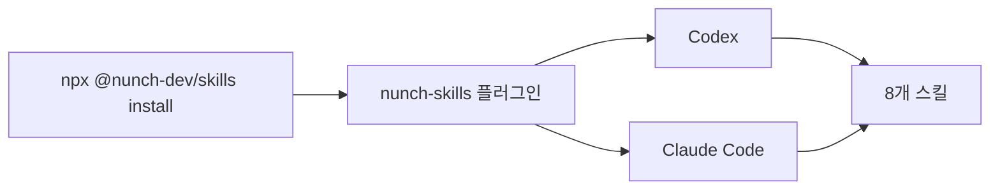

import { Card, CardGrid } from '@astrojs/starlight/components';

## 한 번 설치하고, 필요한 스킬을 고릅니다

`nunch-skills`는 Codex와 Claude Code에 같은 스킬 번들을 설치합니다. 각 스킬은 문서화, Git 작업, 요구사항 인터뷰, 한국어 윤문처럼 서로 다른 작업 경계를 맡습니다.

<CardGrid stagger>
	<Card title="처음 설치한다면" icon="add-document">
		Node.js 22 이상을 준비하고 [설치와 첫 사용](/getting-started/)을 따라가세요.
	</Card>
	<Card title="어떤 스킬을 쓸지 모르겠다면" icon="open-book">
		[스킬 고르기](/skills/)에서 요청과 결과를 비교하세요.
	</Card>
	<Card title="개발과 배포를 준비한다면" icon="setting">
		[로컬 개발과 QA](/guides/local-development/)와 [릴리스 런북](/guides/release-runbook/)을 확인하세요.
	</Card>
</CardGrid>

## 구성 흐름

설치 명령은 하나지만 스킬은 요청에 맞춰 선택합니다. 플러그인의 실제 실행 규칙은 각 `SKILL.md`가 소유하고, 이 사이트는 설치 전 탐색과 일반 사용을 돕습니다.
